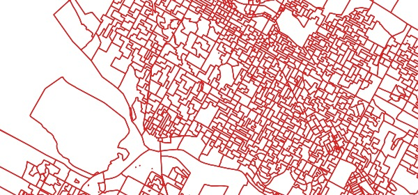
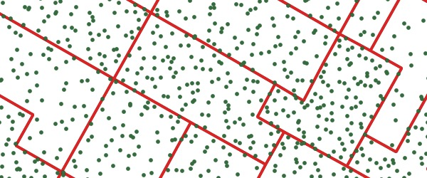

## PostgreSQL 12 + PostGIS 3 实现FULL PARALLEL - GIS计算智能并行  
                                                                                                                                                    
### 作者                                                                                                                                                    
digoal                                                                                                                                                    
                                                                                                                                                    
### 日期                                                                                                                                                    
2019-06-05                                                                                                                                                    
                                                                                                                                                    
### 标签                                                                                                                                                    
PostgreSQL , function , optiminizer , SUPPORT support_function , gis , parallel         
                                                                   
----                                                                                                                                              
                                                                                                                                                
## 背景   
PostgreSQL 的优化器是基于CBO的，所以并行计算实际上也是根据成本决策，例如一个表只有几条记录，会不会开启并行呢？  
  
实际上，除非你的SQL里面有一些OP或者UDF，并且这些OP或UDF设置了非常大的COST，使得并行的COST低于非并行的COST，才会使用并行计算。  
  
那么这会要求用户有意识的去设定这些真的是耗费非常巨大的UDF或OP。  
  
PostGIS是一款GIS插件，通常GIS计算的耗费是比较大的，也就是说几条或者几千条这种小量级数据的GIS查询，以往可能优化器压根就不会选择并行计算（除了前面说的那种情况，用户设定了GIS函数的COST很大，或者使用了HINT，或者用户设置了强制并行度）。  
  
那么怎样让数据库智能的根据UDF成本，更好的估算COST，使得在小数据量下，也会智能的选择并行呢？  
  
PostgreSQL 12 有一个新特性，支持函数的成本估算接口，每一个函数都可以自定义成本估算接口函数。  
  
[《PostgreSQL 12 preview - 优化器接口 - 自定义函数成本估算优化接口》](../201905/20190515_01.md)    
  
PostGIS 3利用了这个接口，在某些计算量很大的函数上，实现了更加智能的COST估算，使得PG 12结合POSTGIS 3可以更加的智能，选择并行计算。  
  
## 说明  
http://blog.cleverelephant.ca/2019/05/parallel-postgis-4.html  
  
With PostgreSQL 11, most parallelization worked, but only at much higher function costs than we could apply to PostGIS functions. With higher PostGIS function costs, other parts of PostGIS stopped working, so we were stuck in a Catch-22: improve costing and break common queries, or leave things working with non-parallel behaviour.  
  
For PostgreSQL 12, the core team (in particular Tom Lane) provided us with a sophisticated new way to add spatial index functionality to our key functions. With that improvement in place, we were able to globally increase our function costs without breaking existing queries. That in turn has signalled the parallel query planning algorithms in PostgreSQL to parallelize spatial queries more aggressively.  
  
## 例子  
### Setup  
In order to run these tests yourself, you will need:  
  
PostgreSQL 12  
  
PostGIS 3.0  
  
You’ll also need a multi-core computer to see actual performance changes. I used a 4-core desktop for my tests, so I could expect 4x improvements at best.  
  
The setup instructions show where to download the Canadian polling division data used for the testing:  
  
```  
pd a table of ~70K polygons  
pts a table of ~70K points  
pts_10 a table of ~700K points  
pts_100 a table of ~7M points  
```  
  
  
  
We will work with the default configuration parameters and just mess with the max_parallel_workers_per_gather at run-time to turn parallelism on and off for comparison purposes.  
  
When max_parallel_workers_per_gather is set to 0, parallel plans are not an option.  
  
max_parallel_workers_per_gather sets the maximum number of workers that can be started by a single Gather or Gather Merge node. Setting this value to 0 disables parallel query execution. Default 2.  
Before running tests, make sure you have a handle on what your parameters are set to: I frequently found I accidentally tested with max_parallel_workers set to 1, which will result in two processes working: the leader process (which does real work when it is not coordinating) and one worker.  
  
```  
show max_worker_processes;  
show max_parallel_workers;  
show max_parallel_workers_per_gather;  
```  
  
### Aggregates  
Behaviour for aggregate queries is still good, as seen in PostgreSQL 11 last year.  
  
```  
SET max_parallel_workers = 8;  
SET max_parallel_workers_per_gather = 4;  
  
EXPLAIN ANALYZE   
  SELECT Sum(ST_Area(geom))   
    FROM pd;  
```  
  
Boom! We get a 3-worker parallel plan and execution about 3x faster than the sequential plan.  
  
### Scans  
The simplest spatial parallel scan adds a spatial function to the target list or filter clause.  
  
```  
SET max_parallel_workers = 8;  
SET max_parallel_workers_per_gather = 4;  
  
EXPLAIN ANALYZE   
  SELECT ST_Area(geom)  
    FROM pd;   
```  
  
Boom! We get a 3-worker parallel plan and execution about 3x faster than the sequential plan. This query did not work out-of-the-box with PostgreSQL 11.  
  
```  
 Gather    
   (cost=1000.00..27361.20 rows=69534 width=8)  
   Workers Planned: 3  
   ->  Parallel Seq Scan on pd    
   (cost=0.00..19407.80 rows=22430 width=8)  
```  
  
### Joins  
Starting with a simple join of all the polygons to the 100 points-per-polygon table, we get:  
  
```  
SET max_parallel_workers_per_gather = 4;  
  
EXPLAIN    
 SELECT *  
  FROM pd   
  JOIN pts_100 pts  
  ON ST_Intersects(pd.geom, pts.geom);  
```  
  
  
  
Right out of the box, we get a parallel plan! No amount of begging and pleading would get a parallel plan in PostgreSQL 11  
  
```  
 Gather    
   (cost=1000.28..837378459.28 rows=5322553884 width=2579)  
   Workers Planned: 4  
   ->  Nested Loop    
       (cost=0.28..305122070.88 rows=1330638471 width=2579)  
         ->  Parallel Seq Scan on pts_100 pts    
             (cost=0.00..75328.50 rows=1738350 width=40)  
         ->  Index Scan using pd_geom_idx on pd    
             (cost=0.28..175.41 rows=7 width=2539)  
               Index Cond: (geom && pts.geom)  
               Filter: st_intersects(geom, pts.geom)  
```  
  
The only quirk in this plan is that the nested loop join is being driven by the pts_100 table, which has 10 times the number of records as the pd table.  
  
The plan for a query against the pt_10 table also returns a parallel plan, but with pd as the driving table.  
  
```  
EXPLAIN    
 SELECT *  
  FROM pd   
  JOIN pts_10 pts  
  ON ST_Intersects(pd.geom, pts.geom);  
```  
  
Right out of the box, we still get a parallel plan! No amount of begging and pleading would get a parallel plan in PostgreSQL 11  
  
```  
 Gather    
   (cost=1000.28..85251180.90 rows=459202963 width=2579)  
   Workers Planned: 3  
   ->  Nested Loop    
       (cost=0.29..39329884.60 rows=148129988 width=2579)  
         ->  Parallel Seq Scan on pd    
             (cost=0.00..13800.30 rows=22430 width=2539)  
         ->  Index Scan using pts_10_gix on pts_10 pts    
             (cost=0.29..1752.13 rows=70 width=40)  
               Index Cond: (geom && pd.geom)  
               Filter: st_intersects(pd.geom, geom)  
```  
  
### Conclusions  
With PostgreSQL 12 and PostGIS 3, most spatial queries that can take advantage of parallel processing should do so automatically.  
  
!!!!!!!!!!!  
  
## 参考  
http://blog.cleverelephant.ca/2019/05/parallel-postgis-4.html  
  
[《PostGIS 地理信息、栅格数据 多核并行处理(st_memunion, st_union)》](../201703/20170307_03.md)    
  
[《PostgreSQL 12 preview - 优化器接口 - 自定义函数成本估算优化接口》](../201905/20190515_01.md)    
  
  
  
  
  
  
  
  
  
  
  
  
  
  
  
  
  
  
  
  
  
  
  
  
  
  
  
  
  
  
  
  
  
  
  
  
  
  
  
  
  
  
  
  
  
  
  
  
  
  
  
  
  
  
  
  
  
  
  
  
  
  
  
  
  
  
  
  
  
  
#### [PostgreSQL 许愿链接](https://github.com/digoal/blog/issues/76 "269ac3d1c492e938c0191101c7238216")
您的愿望将传达给PG kernel hacker、数据库厂商等, 帮助提高数据库产品质量和功能, 说不定下一个PG版本就有您提出的功能点. 针对非常好的提议，奖励限量版PG文化衫、纪念品、贴纸、PG热门书籍等，奖品丰富，快来许愿。[开不开森](https://github.com/digoal/blog/issues/76 "269ac3d1c492e938c0191101c7238216").  
  
  
#### [9.9元购买3个月阿里云RDS PostgreSQL实例](https://www.aliyun.com/database/postgresqlactivity "57258f76c37864c6e6d23383d05714ea")
  
  
#### [PostgreSQL 解决方案集合](https://yq.aliyun.com/topic/118 "40cff096e9ed7122c512b35d8561d9c8")
  
  
#### [德哥 / digoal's github - 公益是一辈子的事.](https://github.com/digoal/blog/blob/master/README.md "22709685feb7cab07d30f30387f0a9ae")
  
  

  
  
#### [PolarDB 学习图谱: 训练营、培训认证、在线互动实验、解决方案、生态合作、写心得拿奖品](https://www.aliyun.com/database/openpolardb/activity "8642f60e04ed0c814bf9cb9677976bd4")
  
