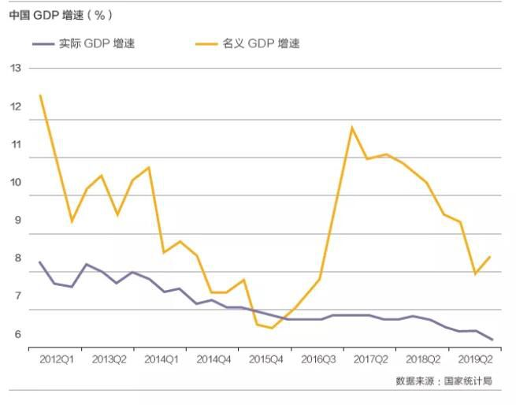
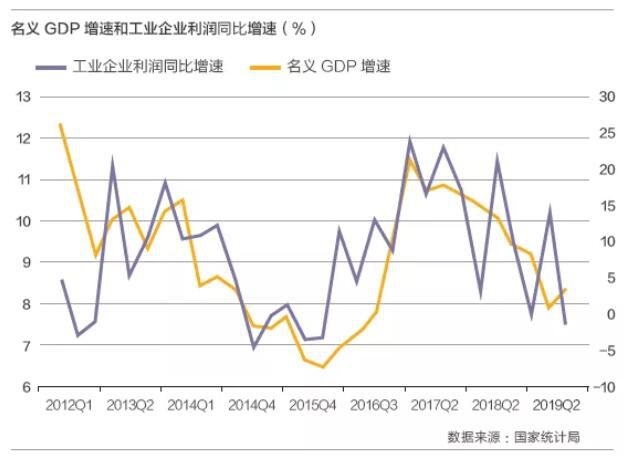

## [转]徐奇渊：如何理解中国经济所处的经济周期 - 名义GDP , 实际GDP  
  
### 作者  
digoal  
  
### 日期  
2021-01-10   
  
### 标签  
PostgreSQL , 经济周期 , 名义GDP , 实际GDP  
  
----  
  
## 背景  
http://www.china-cer.com.cn/zhonghong/201911121069.html  
  
GDP的统计核算有生产法、支出法和收入法三个一致的口径。  
从收入法角度来看:  
- 实际GDP增速对应于真实财富的创造，以及与之对应的就业情况、社会稳定状况。   
- 名义GDP增速等同于各经济部门的收入名义增速。即，劳动者的工资、企业的利润、银行的利息、政府的税收、土地的租金，这五个部门整体收入的增速，正是对应着名义GDP增速。  
  
如果居民收入、企业利润增速放缓到一定水平以下，其将难以偿还银行贷款的本金和利息。这也就是说，GDP名义增速的下降、放缓，对金融体系的稳定性将产生冲击和影响。    
  
- GDP实际增速 对应于 就业、社会稳定  
- GDP名义增速 对应于 名义收入、金融体系的稳定。  

编者语：过去10年以来中国GDP实际增速趋缓。这就产生了一种困惑：中国经济似乎失去了波动性和周期性。中国经济到底走到了何处？在经济周期中处于什么位置？如果无法回答这一问题，宏观政策和微观主体的选择就将缺乏方向感。徐奇渊教授指出，实际增速体现的经济周期在消失，而名义增速体现的周期仍然显著，经济周期仍然存在于名义GDP增速之中；宏观经济政策需要更加重视名义GDP增速，不但要对实际增速设定增长目标，而且也要对名义增速有一个隐含的政策目标。敬请阅读。   
  
## 扩展
http://xima.tv/LwmA1b?_sonic=0  

到了今天经典意义上的信息化革命已经结束了。所以今天的互联网人都在谈什么？在谈产业互联网。 2013年底有个词叫作：“互联网+”， 2014年被李克强总理写进了中国政府报告。距离这个词的出现已经六年过去了，互联网早已不再是一个单独的产业，它变成了像水电一样的基础设施，向各行业渗透，而且每个渗透基本上已经到了末端。我们期待第四次浪潮的到来。  
   
什么是第四次浪潮呢？现在就是第四次浪潮，上海不出意外，今年上半年要开科创板了，你看科创板里面的备选公司是哪些公司呢？第一大类是人工智能，第二大类是机器人，第三大类是物联网，第四大类是新能源和环保技术。  
   
说明在2019年的今天，我们处在一个产业的空窗期和苦闷期，我们正在由第三次浪潮向第四浪潮所转移。但是很多我们这里讲到的技术，它们的成本还非常地高，甚至有些还在实验阶段，有些仅仅是个泡沫。但他们长期来看都是真实的。  
  
当处于产业空窗期的时候，全球经济是非常苦闷的。各个国家都开始修墙了，移民政策都开始缩紧了，右翼民粹主义和保守主义势力都开始崛起了。为什么大家都不推动全球化的发展了？因为在产业的苦闷期，只能干两件事情，第一件事情：做篱笆墙(例如maoyi战)，把自己好的弄进去，不让人家进来。第二件事情：印钞票，保持国家货币的适度通货膨胀。 这就是唯一能干的两件事。  
  
ps:  类似小时候读书， 班上成绩好的几个同学都遇到瓶颈了， 大家可以选择相互取长补短互相进步， 也可能出现相互藏掖的情况， 好的东西都藏起来， 甚至还去搞别人，同时潜心研究突破方法。   
今天如果全球进入产业苦闷期， 其实就是需要潜心寻找突破， 国家之间可能出现的情况互相合作，冷战，扮猪吃老虎都有可能。   
  
   
### 文/徐奇渊（中国社会科学院世界经济与政治研究所经济发展研究中心执行主任）  
   
### 过去10年GDP实际增速持续下行，宏观周期似乎消失  
   
2009年的4万亿刺激计划之后，2010年GDP增速达到了10.6%的高点。在此之后，GDP增速几乎呈现单向递减。2012年增速降至8%以下。2014年，党中央提出中国经济增长进入了新常态。2015年增速降至7%以下，同年12月，中央经济工作会议提出了供给侧结构性改革。2016年4月10日，《人民日报》权威人士指出，中国经济增长从高速向中高速换挡，中国经济增长进入L型，政策要保持定力。  
   
在2016年初之后，以“三去一降一补”为重点任务的供给侧结构性改革顺利推进。2016至2018年三年的去产能目标，在前两年已经接近完成。其中，2017年的GDP增速较上年上升0.1个百分点，虽是微弱反弹，但也是多年以来少见。  
   
  
   
从2017年中的全国金融工作会议开始，尤其是2018年初以来，去杠杆、防风险和金融供给侧结构性改革成为政策重点。在这一阶段，一度出现了宽货币和紧信用的矛盾，货币政策传导机制受到了影响，再加上中美贸易冲突导致的外部不确定性，投资增速和出口增速渐次放缓，中国的经济下行压力进一步加大。2018年4季度GDP增速下行至6.4%。  
   
2018年12月中央经济工作会议和此后2019年3月的政府工作报告，以及最近的7月31日政治局会议，都更加强调防范金融风险要注意“把控节奏和力度”，这表明金融供给侧改革已经走向更为成熟的路径。不过，2019年上半年增速为6.3%，仍然创出了新低。  
   
对于中国经济增速的持续放缓，经济学家给出了各种解释，比如：人口老龄化、全球化进程停滞甚至倒退、技术进步放缓、改革进入深水区、中国经济基数已经达到巨大规模等等。这些分析解释了GDP实际增速下行的原因，并有助于明确中长期的改革方向，但是仍然无法回答当前中国经济处于经济周期的什么位置。  
   
### 经济周期仍然存在于名义GDP增速之中  
   
从名义GDP增速来看，中国宏观经济仍然存在显著的周期性。2012年1季度，名义GDP增速超过12%，之后波动下行，在产能过剩持续、物价走低的背景下，名义GDP增速在2015年4季度跌至6.4%。2016年初之后，在外需好转、去产能政策等因素的推动下，名义GDP增速明显回升。2017年初达到了11.5%，成为本轮周期的顶峰。2017年初以来的两年半当中，名义GDP增速逐渐放缓，2019年上半年已经降至8%附近，较2017年初下降了3.5个百分点。事实上，从近30年的数据来看，名义GDP增速一直保持着显著的周期性。  
   
  
   
### 经济周期的两个视角：名义增速、实际增速  
   
从前面的观察来看，实际增速体现的经济周期在消失，而名义增速体现的周期仍然显著。事实上，这两个周期各有其政策含义。其中，实际增速对应于真实财富的创造，以及与之对应的就业情况、社会稳定状况。  
   
如何理解名义GDP增速对应的经济周期？因为GDP的统计核算有生产法、支出法和收入法三个一致的口径。从收入法角度来看，名义GDP增速等同于各经济部门的收入名义增速。即，劳动者的工资、企业的利润、银行的利息、政府的税收、土地的租金，这五个部门整体收入的增速，正是对应着名义GDP增速。  
   
在通胀率较为温和、可控的前提下，名义GDP增速上升，意味着上述五个部门名义收入的增加，反之亦然。这时候，名义GDP增速的波动，就构成了微观主体对经济周期的感知。相较而言，宏观决策部门更加关心就业，所以更加关注GDP的实际增速。而在通胀率较为温和的前提下，居民、企业等更加关心名义收入，因此其对经济周期的感受，就与名义GDP增速周期的关系更加密切。从工业企业部门的利润同比增速来看，其与GDP名义增速具有较为显著的相关性。2012年1季度至2019年2季度，工企利润增速与名义GDP增速的简单相关系数为0.50，而与实际GDP增速的相关系数仅为0.02。  
   
进一步地，如果居民收入、企业利润增速放缓到一定水平以下，其将难以偿还银行贷款的本金和利息。这也就是说，GDP名义增速的下降、放缓，对金融体系的稳定性将产生冲击和影响。可见，GDP实际增速对应于就业、社会稳定，而GDP名义增速对应于名义收入、金融体系的稳定。  
   
从历史经验来看，如果名义GDP增速降至6.5%附近，甚至低于6.5%，则银行体系的不良贷款率将面临较大压力，从而使得金融体系的稳定性面临一定挑战。1998年至1999年、2009年上半年的短暂时期以及2015年末前后，就曾经面临这方面的压力。尤其是1998年至1999年，名义GDP增速一度低至6.0%附近，创出了迄今为止的历史最低值。在当时，中国金融体系面临了较为严峻的稳定压力。  
   
2019年上半年，中国的名义GDP增速在8%上下波动，并且仍然面临一定下行压力。宏观经济政策需要更加重视名义GDP增速，不但要对实际增速设定增长目标，而且也要对名义增速有一个隐含的政策目标，这个目标宜在6.5%或以上。（完）  
     
  
#### [PostgreSQL 许愿链接](https://github.com/digoal/blog/issues/76 "269ac3d1c492e938c0191101c7238216")
您的愿望将传达给PG kernel hacker、数据库厂商等, 帮助提高数据库产品质量和功能, 说不定下一个PG版本就有您提出的功能点. 针对非常好的提议，奖励限量版PG文化衫、纪念品、贴纸、PG热门书籍等，奖品丰富，快来许愿。[开不开森](https://github.com/digoal/blog/issues/76 "269ac3d1c492e938c0191101c7238216").  
  
  
#### [9.9元购买3个月阿里云RDS PostgreSQL实例](https://www.aliyun.com/database/postgresqlactivity "57258f76c37864c6e6d23383d05714ea")
  
  
#### [PostgreSQL 解决方案集合](https://yq.aliyun.com/topic/118 "40cff096e9ed7122c512b35d8561d9c8")
  
  
#### [德哥 / digoal's github - 公益是一辈子的事.](https://github.com/digoal/blog/blob/master/README.md "22709685feb7cab07d30f30387f0a9ae")
  
  

  
  
#### [PolarDB 学习图谱: 训练营、培训认证、在线互动实验、解决方案、生态合作、写心得拿奖品](https://www.aliyun.com/database/openpolardb/activity "8642f60e04ed0c814bf9cb9677976bd4")
  
