## 转 陆奇最新演讲：2020，被加速的4大趋势  
            
### 作者            
digoal      
            
### 日期            
2021-01-29      
            
### 标签            
PostgreSQL , 趋势 , 2020    
            
----            
            
## 背景     
[《新冠，为什么rmb会升值 - 国家需要什么，全球需要什么，我们做什么? 为什么? - GDP , 外汇 之间有什么关系?  - 乱弹》](../202101/20210118_04.md)    
  
[《[转载]2020年中央经济工作会议》](../202012/20201230_01.md)    
  
https://www.toutiao.com/i6909577399264870925/?timestamp=1608770135&app=news_article&group_id=6909577399264870925&use_new_style=1&req_id=202012240835350102040501033917E83D  
  
https://t.qianzhan.com/daka/detail/200122-12a55a4f.html  
  
2020年12月19日，奇绩创坛创始人兼CEO陆奇在深圳做了一场主题演讲《新格局下的创业创新机会》。陆奇博士在将近2小时的演讲中，分析了当前世界正在形成的新格局以及正在被历史加速的四大核心趋势；他系统地梳理了创业者所面临的完整的创业机会，包括对当下投资比较热门的数字化、芯片、传感器、生命科学、航天等领域的分析；此外，关于新一代的创业者要如何把握属于自己的机会，他分享了一系列的思考模型，包括创业者能力模型、如何判断时机、如何打造壁垒以及如何思考商业价值等。  
  
文| 陆奇 奇绩创坛创始人、首席执行官  
  
转载来源 | 腾讯科技 （本文略有删改）  
  
如下为演讲文字稿  
  
陆奇：非常感谢大家在周末抽出宝贵的时间。我代表奇绩创坛的整个团队，欢迎大家参加我们的创业者见面分享会。  
  
开始之前，我先介绍我们分析问题的思路：任何一件值得去做的事情，先要了解它的驱动力在哪里，为什么这件事情会发生，如果发生，未来会朝什么方向走，它的结构是怎样的。因为有了结构很容易看到未来，然后在结构下会形成演变的发展体系。  
  
## 01 历史进程加速，世界形成新的格局  
  
### 1. 新冠疫情和国际环境正在极大地加速四大趋势  
  
首先，历史进程在加速，新冠疫情是现代社会第一次全球规模的疫情。比尔盖茨先生写了一篇文章，他分析了为什么新冠疫情会带来一个全新的格局。文章的核心是参考黑天鹅事件对历史所造成的巨大影响，黑天鹅事件发生的概率很小，但是对世界影响很大。它的直接影响是，目前已经在发生的几个核心历史潮流都被大幅加速了，原本可能要五年、十年以后才会发生的事情，因为疫情的原因，时间被缩短了，有的现在就开始发生了。  
  
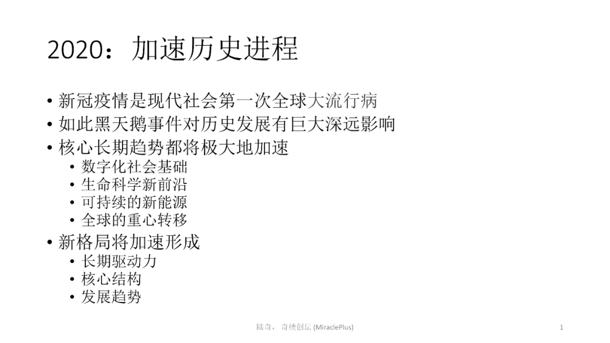  
这些被加速的长期核心趋势有四种：  
  
第一是数字化的社会基础。比如远程办公、线上开会、远程教育等，随着疫情的加速，它们已经成为任何现代社会必备的基础设施，就像公路铁路一样。  
  
第二是生命科学的前沿，就像国防工业一样，帮助人防御来自大自然的灾害。今天新冠这样一个病毒，它基本上只有几微米的体积，所存的信息量也很少，可它为什么能对整个地球产生如此巨大的影响？我们在重新思考人和自然界的关系，这会促进生命科学新前沿的发展，包括测试、疫苗和大量的药物开发，这一系列的投入会在全球范围内加速，带来很多机会。  
  
第三，可持续的新能源，这背后其实是人和大自然的关系是必须要解决的，到目前为止我们发展经济都是在假设“大自然是免费的”，其实它并不是，所以我们必须进入一个新的、市场化的、可持续的关系，这将带来大量的产业发展机会。  
  
第四，全球经济发展和创新的重心从西方转移到亚洲。  
  
所有这四个趋势都在被加速，全球因此形成了一个新的格局。  
  
### 2. 历史进程的深层长期驱动力  
  
那么我们如何来分析这个新格局，并从中看到创业机会呢？  
  
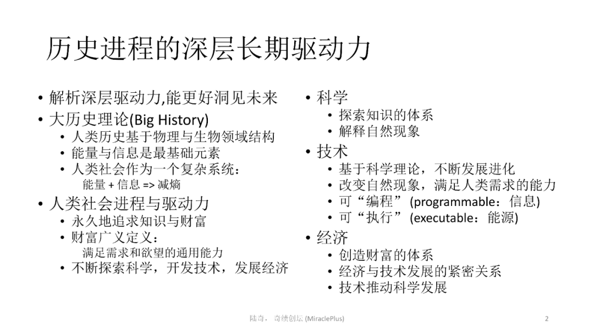  
我们先分析一下人类历史的进程，看看它深层的驱动力是什么？这里我推荐大历史理论，其实也是我在微软工作的收获之一。盖茨先生一直推荐我一系列的书，有位作者叫David Christian，他的大历史理论的核心概念是，要研究人类历史、判断未来，起步要看物理世界和生物世界，看它们里面的深层结构是什么？它的核心元素是什么？答案是能量和信息。  
  
人类社会发展核心永远是能量和信息的组合，任何一个复杂体系，最终都是能量+信息，产生熵减，我们所做的一切都是减熵行为，这会给我们一个最底层的原则来判断，某件事情会不会发生，信息是不是错了，能源是不是可以更高效地转化，熵是不是减了，这些是驱动我们最深层的因素。  
  
把它映射到人类社会里面，人类社会永远追求知识和财富，这里财富是大家都接受的一个广义的定义，即财富是能够满足人类需求和欲望的通用能力。所以按照大历史理论推演，人类的历史永远在探索科学、开发技术、发展经济。  
  
我简单讲一下科学、技术和经济体系是什么，以及它们之间的关系。  
  
科学是探索知识的一个体系，是一个知识开发体系(system of inquiry)，核心是一组可以被否定的假设(falsifiable hypothesis)，它主要是用来解释自然现象的。  
  
而技术不同于科学，它是基于科学，但是会不断地自我演化，跟达尔文演化很类似，技术的演化是永远朝着人类需求多的方向去发展。所以技术的核心定义是：技术是基于科学的理论，用来改变自然现象，满足人类需求的一种能力，这是最为广义的关于技术的定义。  
  
技术有两个特点：第一它是可编程的，我们必须要有一个信息的过程，去改变自然现象；第二它是可执行的，我们必须要有能源，通过物理过程、化学过程、生物过程来改变自然现象。所以我们今天所做的一切都跟技术的本质有关。  
  
前面讲到技术永远朝着人类需求多的地方去不断演化，所以发展技术一定要跟人的需求直接有关，常见一个很大的误区就是脱离人类需求只看技术，但技术永远是跟着人类需求走，需求越多越深的地方，技术发展越活跃，所以它跟经济体系是完全符合的。  
  
除了科学和技术，我们再看一下市场。人类创造了不同阶段的市场经济，它是创造财富的体系，它跟科学和技术发展的关系是紧密相结合的，三者永远是相互交互，不断朝着人类的需求发展。但是人类社会又是一个非常不一样的系统，我们对知识的开发是永无止境的，永远在减熵。  
  
### 3. 信息和能源是历史发展中最深层的结构  
  
人类历史发展中的经济行为其实在过去几千年一直变化较小，直到在过去三、四百年才产生了加速的变化。核心是因为我们发明了新的体系，信息和能源的结构让我们能够更多地满足人类的需求。下面这张图介绍了人类经历的三个体系，我们现在处在第三个体系，即所谓“新经济”。  
  
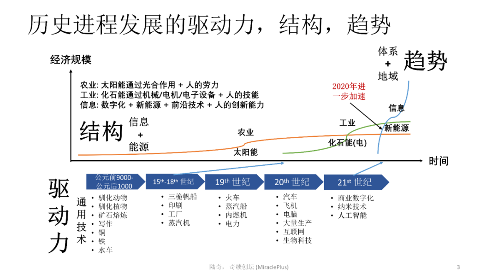  
第一个体系：农业体系，核心是太阳能。从地球角度来说，这是一个免费的能源，太阳上的核聚变带来了能够产生光合作用的能源。因为农业的能源是太阳，它的信息过程相对来讲很简单，它的产出（农作物）基本上是通过光合作用加上人的劳力和简单的工具来实现的，所以在农业社会，即便人再聪明，产出永远被有多少亩地以及一年能接收多少阳光所决定。回顾过去，农业时代的历史都是控制土地的历史。  
  
第二个体系：工业时代。工业时代的核心是大规模生产和大规模的流通，它的能源和信息结构又完全不一样，能源主要是化石能源，一开始是煤炭，通过机械方法转化能量，做有用功，之后是将石油天然气变成电能，通过电机、电子设备来做能量的转化。  
  
信息的过程更复杂，对人的技能要求也更高，因此这一时期诞生了人类社会的一系列机构，包括大学等。培养了大量的工程师、厨师、裁缝、设计师等。对比农业时代和工业时代的两个曲线（上图红色和绿色曲线）可以发现，农业时代的S曲线非常（红色曲线）扁平，产出有限，工业时代（绿色曲线）就快很多。  
  
第三条蓝色的曲线代表着我们今天所处的、速度最快、最振奋人心的一个时代，可以把它叫做新经济。它是个信息时代，而什么触发了这个时代？答案是在上个世纪中叶我们发明了通用计算机，它可以让我们大规模地获取信息，通过计算来设计、模拟、预测、做自动化等等。所以这个时代创造财富的核心是通过数字化加上新的能源，应用新的技术，来快速地组合资源创造财富。  
  
往后退20年看，当时世界上市值高的的公司都是以制造和能源为主的公司，而当下市值高的公司都是数字化驱动的公司，核心就在于数字化可以在很短的时间，用一部分的能量，通过大规模地资源组合来满足人的需求，从而大大加快创造财富的速度。  
  
任何一个时代它都有一个主流，我们这个时代的主流是数字化的能力，加上新的能源、新的技术和人的创新能力，这样只凭大学里面学习技能就完全不够了。更核心的是通过对需求的敏感观察，快速重组资源来创造价值，所以这是我们这个时代需要关注的。  
  
### 4. 以Deepmind、OpenAI为代表的新一代研究型创业企业在涌现  
  
刚才讲到的是历史进程的核心驱动力与深层结构，接下来我讲一下第三层因素。在历史发展过程当中，形成发展体系，它往往是所谓的“形成体系”（emergent）。  
  
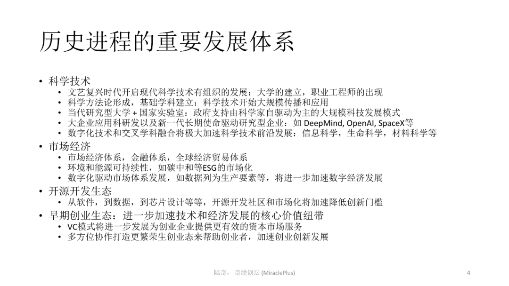  
#### （1）科学与技术的发展  
  
首先我讲一下科学是怎么发展的？科学其实很早就开始了，在古希腊就有亚里士多德、阿基米德等人在研究科学，但是没有系统化的发展。  
  
科学真正系统化的发展是在文艺复兴时代，当时在佛罗伦萨有社会的需求，足够的需求造成了足够密度的一群人开始做实验，建立大学，工程师作为一个职业也出现了。  
  
接下来两三百年的历史中，科学的方法论形成了。基础科学，特别是牛顿等科学家建立的基础，使得科学和技术的发展在西方开始大规模传播和运用。  
  
第三个发展阶段是“当代研究型大学+国家实验室”，由政府支持、科学家自驱动。这种大规模的科技发展模式，它开始于上个世纪二战结束以后的美国。我们推荐一篇历史文献（Science The Endless Frontier），作者是范内瓦·布什（Vannevar Bush）。当时罗斯福总统曾请他写过一篇计划，内容是二战后美国如何保持领先。他提出的核心概念就是“国家支持研究性大学和国立实验室”，关键是国家投入但让科学家自主驱动，这开启了大规模主流科学技术的推广，尤其是工程技术和人才的开发。  
  
这里强调一点，当初在1944-1945年有很大争议的一点就在于：研究内容是由科学家自己决定，还是政府决定，最终选择是科学家自主驱动。这个体系持续到今天，效果也非常好，但是也需要演进。  
  
今天，除了“国家支持研究性大学和国立实验室”，大企业在做一些弥补，像谷歌、阿里巴巴等大企业，它们也开始做很多科研，但是以应用科研为主。  
  
除此以外，我们会建议大家关注一个点：有一波年轻的长期使命驱动的研究型创业企业在开始成为重要的前沿驱动力，例如DeepMind，OpenAI，SpaceX，这些都是小公司开启的，但是它们有长期的、宏大的使命，它们走得比大公司还快。  
  
所以，如果我们仔细思考一下，人工智能前沿到底是谁真正在驱动？答案是有一些大公司，也有一些大学和科研机构，但其中跑得最快的却是DeepMind、OpenAI这样的研究型创业公司。  
  
DeepMind可能大家最近都知道，AlphaFold对蛋白质折叠有巨大的突破，OpenAI的GPT3对创新也带来了巨大的影响，SpaceX对航天发展的贡献，这些都是新一代的emergent的体系在形成。  
  
同时数字化技术和交叉学科在大大加速科学和技术的发展，比如信息科学、生命科学和材料科学等。我们活在一个非常振奋人心的时代，如果观察每个科学领域，它们几乎都在高速发展。  
  
#### （2）科学技术与市场  
  
这里我再讲一下市场的重要性。某种意义上来说，市场是一个很大的优化器，任何一件事情如果在市场上可以做，往往可以走得更快、影响范围更广。市场核心的一点是它把每个人出于个人目的做的事情，变成对别人有用的。  
  
市场上往往有非常好的信号来判断某个技术是否有活力，是否能满足很多人的需求。但市场缺了一个环节，它假定了“大自然是免费的”，这是我们全球都需要去做的，包括中国也提出了2060年实现碳中和的目标。因此，很多人预测未来十年最大的产业之一就是能源和环境的可持续性，比如碳中和与ESG的市场化。  
  
同时，数字化的能力在驱动市场高速发展，比如数据已经被国家列为核心生产要素。数据的资产化有很多创业公司也开始在做，这将会进一步驱动数字化经济的发展。所以市场是一个非常大的体系，在不断的演变和成长。  
  
#### （3）开源开发是更优越的开发方式  
  
关于开源开发，我们都认为对于技术而言，开源开发是越来越主流且更为优越的开发方式。过去三四十年，IT工业的发展离不开开源软件，未来人工智能的发展也离不开开源的数据。今天中国及全球芯片的发展离不开开源的芯片体系，生命科学也是如此。开源不纯是市场，它更是一个社区和市场相交合的组织形式，我们认为开源是非常值得关注的一个发展体系。  
  
#### （4）早期创业生态是连接科学技术与市场的纽带  
  
最后是讲一下我们今天交流的主题——早期创业生态。如果要站在未来回看历史，当下哪个环节是最需要发力的？答案就是早期创业生态。因为早期创业生态是科学技术与市场经济之间的核心连接。  
  
今天的VC模式只有60多年的历史，需要更进一步的开发，从而能让资本市场更好地服务好创业者。同时我们坚信社区更是重要的一环。  
  
### 5. 新时代的主旋律：“中国+技术”是最大的市场机会  
  
在历史加速下的新格局里，它的主旋律是什么？我们认为毫无疑问是“中国+技术”。中国过去40年的经济发展，取得了令人非常骄傲的成绩，它本质上是“中国+开放市场”，下一阶段是“中国+技术”，在历史上这是巨大的市场机会和发展机会。  
  
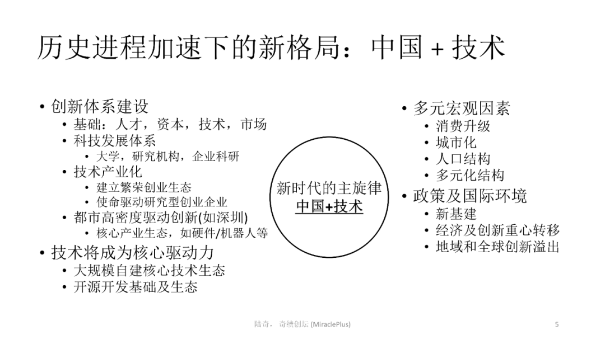  
首先分析一下，我们的创新体系基础基本到位了，我们有足够的人才、资本、技术和足够规模的市场，包括大家都在讲的双循环。但是技术将会成为一个主要的驱动力，因此我们必须在新的全球格局下，大规模地自建核心技术以及生态。有些技术和生态需要五年、十年的时间，但有大量的需求。  
  
纵观历史，驱动创新速度的是城市要有足够密集的人才、创业机会和市场机会，以及供应链、流量、设备等配套。在中国，大都市如北京、上海、深圳、南京等，都有机会提供超高密度的创新环境。  
  
同时，中国的宏观因素跟全球所有的市场比是最丰富的，因为中国是结构化因素最多的一个国家。第一个因素是消费升级，一般宏观上能拉动经济的就是消费；另外，中国的城市化还有几十年要走；同时中国的人口还在增加。第四点是多元化的结构。这一点我在美国工作期间体会比较少，只有在中国才能体会到它所孕育的机会。  
  
为什么中国能够长出拼多多和美团，而美国长不出来？目前全球的创新体系基本是以美国为主，但是美国并不是理想的创新目标国家，因为美国都是工业化的，农业也已经工业化，这就导致劳力非常贵，有些创新长不出来。  
  
中国是唯一一个除美国之外拥有有大规模技术、互联网公司、开发人员和设计能力的国家，欧洲以及其他地方都没有。同时，中国有一线二线三线等多个经济形态阶梯。如果把中国高密度的创新能力跟阶梯型的经济形态结合，我们创新长出来的结果会非常丰富，而且非常适合溢出到全球其他国家，因为东南亚和拉丁美洲跟我们的国情更接近，比如他们的农业也没有完全工业化。  
  
我想强调一下，在国际环境上，经济中心向亚洲转移是一个被加速了的历史趋势。创新中心转移，中国+技术所蕴含的机会，毫无疑问这是我们这个时代的机会。  
  
同时，中国的创业团队在地域和全球性的溢出能力是非常强的，所以我们是处在一个非常特殊的好的环境里面。关键是在这个格局下，如何抓住具体的创业机会？  
  
## 02 新格局带来的创业创新机会  
  
### 1. 创业的本质是用技术打造产品，用产品试探市场，满足人们需求  
  
在任何一个历史环境下，创业的核心是永远不变的，即优秀的创业者用技术打造产品，用产品试探市场，满足人们需求，从而创造商业价值和社会价值。  
  
创业者需要同时判断好技术、产品、市场三个要素，只有技术上可实现、需求真实存在、市场能形成盈利，这三者同时满足时（即图中三个圆圈形成交集的地方），创业成功概率才能最高。  
  
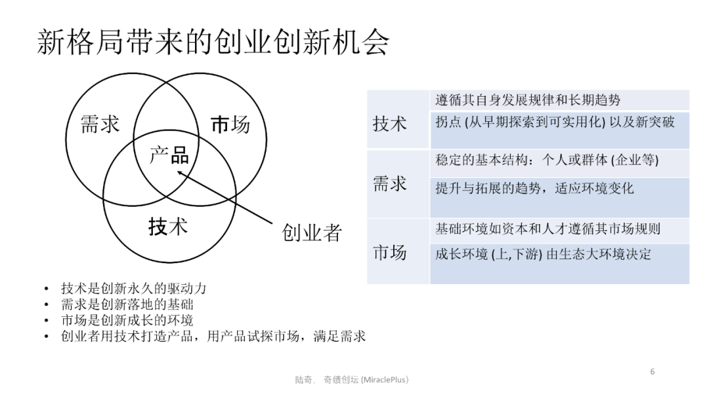  
首先，第一个圆圈是技术，技术相对来说比较容易判断，每个核心技术都遵循其自身的发展规律和趋势，除了少数偶然情况，比如一个神奇的科学家突然发现突破性的东西，在多数情况下，技术基本是稳定地在发展，都是一个长期过程。所以，创业者可以判断某个技术在今天处于什么状态，以及五年后可能的发展状态。  
  
需要注意的是对技术发展拐点的判断，即某样技术从早期探索变成可商业化的时机点，这有一定难度。比如量子计算和脑机接口技术，它们基本还处在早期阶段，但是可能已经接近可实用阶段。  
  
第二个圆圈是需求，需求可能是最难判断的因素，虽然它的基本结构是稳定的，包括群体需求与个人需求，人类需求的结构我们也可以分析。但是最难的地方是判断现在的需求和未来潜在的需求。  
  
比如在2007年第一个苹果手机诞生时，电话都打不通，根本说不清楚它到底满足什么需求？还有特斯拉，它在满足什么新的需求？我们也没法准确地描述。  
  
第三个圆圈是市场，市场相对来说比较稳定，可以参考一些结构化的因素，比如产业链、上下游、资本市场、供给需求、流通端等。我们还要看市场所处环境，包括政策环境、国际环境、国内环境等，基于这样大环境的判断，我们可以系统地观察到机会点在什么地方。  
  
接下来，我们更深入地对技术、需求、市场做更深入的剖析。  
  
### 2. 数字化、新能源、新技术加速发展的前沿  
  
在技术方面，首先我们时代主流的技术驱动因素是数字化技术，数字化技术的发展其实是有规可循的，它基本是由平台来驱动，由数字化的深度和广度而延伸，基本上每隔12年左右会有一个新的平台。（下面这张图基本展示了技术驱动创新前沿的大框架）。  
  
  
我们经历了PC个人电脑时代和PC互联网时代，今天所处的是移动互联网和云的时代，下一阶段将是人工智能/边缘计算及5G时代，之后是AR、VR。脑机接口、量子计算、区块链等新前沿。  
  
数字化平台本身结构，平台分前台和后台，前台是人和数字化平台交互的能力，后台是整体计算的规模，包括信息的密度、信息总量，以及信息传输能够覆盖的地域等。  
  
人工智能和量子计算可能是我们能够看到的两个最大的历史突破。人工智能它核心是一种新的计算体系，它能把物理世界和数字世界融合在一起，任何行业都将被改变，这也是为什么全世界那么多国家都在拼命投入人工智能。量子计算则是更大的计算能力上的突破。  
  
技术驱动的创新是数字化和其它技术发展前沿的组合。  
  
其中第一个技术创新前沿是新能源，我们前面讲了当下的化石能源已经让人类和大自然的关系接近无法再持续的状态，所以能源的再生是非常核心的。所以新型电池包括下一代的氢能源将是一系列创新的机会点。  
  
大家其实没有意识到特斯拉公司的使命，但它其实写得很清楚，它是一家能源公司，汽车只不过是第一个应用。今天大家可以感受到这是一家“能源公司+软件可以更新”的技术驱动设备公司，未来市场空间和市值非常大。中国也有一系列的公司有这样的机会。当然也有新的能源形式，长期来看我们希望能够达到可控核聚变，因为它是效益最高的，科技也在朝这方面走。还有一个核心要做的就是碳捕捉和碳捕捉以后的存储，它的产业化值得每个创业者关注，在全球范围机会也非常大。  
  
新的生命科学也非常振奋人心。因为过去100多年，科学技术的发展让我们对物理世界认识很多，但是对我们自己认识却不够。这一点很快会改观。因为数字化和数据融合，以计算驱动来做合成生物、药物发现和蛋白合成等等在快速地形成，以及我们的数字化观察体系包括感知能力、低温电镜、质谱等在不断发展，它会诞生一系列新的治疗方法，包括基因治疗、免疫治疗、再生医学、纳米药物、质子化疗等精准医疗。在接下来的10-20年里，会是非常有潜能的创新和商业化的赛道。  
  
材料科学也会发生类似的变化。材料科学基本上是研究原子、分子的结构，用什么样的工具和工艺，可以让我们建立想要的结构，这些结构有什么样的特性可以让我们用于建筑或者穿戴等等，这些也开始高速发展，也会进入长期数据和计算驱动的一个学科。  
  
另外一个非常大的领域是航天，包括星际探索、航天产业、新一代的通讯、地球感知体系、地球环境数字化等。我们对地球和环境的理解还比较有限，不过这些也很快会被改变。我们可以通过技术和商业发展，通过创业，在接下来5-20年，让整个地球可计算的能力非常强，很多运用都可以系统化地往前推进。  
  
### 3. AI商业化落地及创业创新的发展趋势  
  
接下来我们具体这个时代最大的驱动力——数字化前沿：AI的发展。  
  
  
任何一项技术的发展，在历史上永远是依赖路径的，AI将主要是在云和移动生态之上来发展的AI时代。  
  
数字化的进展由平台驱动，任何新的平台一开始起来，早期创业公司和大公司基本都是做基础技术的开发。今天AI很多创业公司都是在开发基础技术，包括芯片、传感器等。  
  
同时有早期应用开发，等到有足够的应用和足够的基础，就会形成爆发，这时候平台就发展起来，生态也发展起来了（商业模式加上平台会形成生态），在生态环境下会带动更多的产业发展。  
  
#### （1）移动和云的时代  
  
我讲一下云和移动时代，因为这是非常活跃的数字化技术的创新前沿，很多创业公司可以在这里做。  
  
首先讲一下云和移动时代的核心点：它的前台和后台，两者组合在一起，给了我们什么样的能力，使得我们可以去数字化以前不能被数字化的东西。  
  
移动和云的时代，前台的核心是手指触摸加上相机、定位，我前面说2007年第一个苹果手机出来，我是属于最早一波买的，当时只能AT&T可以用，电话基本打不通，只有6款固定的应用，但大家仍然激动，因为它开启一个新的时代——手指和屏幕的触摸，手指可以真正开始工作，这就是一种定义性的体验。  
  
所以苹果开启了一个时代，我们可以把计算装在口袋里，它可以24小时跟着我们。苹果本质上是一家手指与屏幕交互的公司，就凭这一点可以做到世界最大。因为任何一个数字化的时代，它的起步是人和数字化世界之间的交互，比如微软本质上是一个鼠标键盘公司，企业信息管理、信息流通、企业的流程都可以做，微软也是一家了不起的公司。  
  
从发展方向上看，增加交互能力是趋向，比如现在苹果把激光雷达都放在口袋了，交互感知能力在手机上一定会延伸，因为激光雷达可以做相机不能做的事情。  
  
再看一下移动和云时代的后台，后台是数据中心。这主要是谷歌驱动的，在历史上也非常了不起，它的定义性能力是把一个大的仓库建立成为一个计算机。今天我们都在朝着云原生方向走，云是一个更优越的计算体系。我前面讲到，每个国家数字化的基础就是云原生的服务，所以移动是一个非常重要的时代。虽然人工智能很火，但移动依然是有大量创新空间的一个生态。  
  
#### （2）人工智能时代  
  
我们今天看到的人工智能时代，它本质是从2006年Hinton开启深度学习突破开始的。深度学习本质上是一种新的计算体系，它可以把物理界和自然界的信息眏射到一个重叠的向量空间里，通过深度学习很快地抽取它的重要特征，用这些特征解决我们想解决的问题，也就是快速表达、快速获取知识、快速解决人的需求，这是非常重要的突破。  
  
人工智能时代，它的前台是所有模态的传感器和传动器都可以被开启，今天的创新目前聚焦在传感器的很多方面，比如摄像头、热成像、毫米波雷达、激光雷达等。基于此，很多交互的形式都被打开，对话交互、视觉交互、触觉反馈交互，所有人能够做的交互，人工智能时代将完全打开。  
  
回顾一下历史，苹果做的就是把手指交互做好。因此，可以想象，人工智能时代我们能够做的事情。现在很多设备，比如说智能音箱、IOT设备、自动驾驶车辆、机器人、嵌入式工业设备都在早期，未来都可以形成很大的产业，需要有耐心的创业者去打磨。  
  
人工智能的后台，开启了智能云、智能边缘计算、5G的智能网络、芯片等，所有这些都要重做一遍。中国自建芯片生态，其实从历史上时间窗口来看正好，X86和ARM这些体系架构本身就需要改变，今天所谓的异构计算才是未来真正的主流计算，所以芯片整个会重做。如果要做芯片，机会有很多，当然中国的芯片机会更多。  
  
除此以外，还有系统底层软件、开发工具、新一代的数据管理体系等，这些非常重要的创新也会发展起来。所以创业公司在这里的机会也非常多。  
  
未来的人工智能生态需要平台，我们需要定义性的体验和定义性的能力，这点还早，目前我们还没有看到相应的平台，但这只是时间问题。有哪些可能出现的定义性的体验？我们认为，一辆真正可以在路上开的车、一个完全智能化的学校、一个自动化的医院、一个完整的家庭智能机器人、生命科学里面一个完整的可以让药物开发在体外做的流程等，这些都是定义性的体验或能力，因为它们都可以延伸，通过商业模式，都能形成产业生态。所以人工智能时代未来可以产生的生态很多，并且都是很大的产业生态。  
  
后台能力方面，目前还在早期发展，前面提到了深度学习、智能云，未来会诞生有延伸能力的平台，比如视频原生平台。或者是大模型加大算力的平台等。  
  
数字化的范围，AI数字化的范围是把物理世界和数字世界连在一起。大部分的环境可以从数字孪生进入到数字原生，一辆汽车、一个房间本身都可以数字化。当然数字孪生也很重要，可以做模拟分析等等，但是数字原生更是未来的、长期的重要机会。同时，人工智能也在C端有很多应用，比如直播、视频等等。  
  
#### （3）人工智能之后更前沿的数字化  
  
接下来讲一下人工智能之后我们能看到的更前沿的数字化。交互的方法包括AR、VR，最为重要的是脑机接口，最终人和计算体系的交互可能就是脑机，对方可以直接知道我在想什么。脑机接口技术虽然离商业化还有一段时间，但是创业公司也不少，能够商业化落地的项目也越来越多。  
  
还有量子计算，量子计算里面定义性的能力，可以说是量子优越、量子霸权。潘建伟团队做的是一个比较特殊的量子计算机，就是做Gaussian boson sampling（高斯玻色采样）这一个物理任务，可以验证比传统计算机有巨大优势。量子计算机，区块链的开发，量子优越、以太坊等，这些都是定义性的能力，可以开启未来非常大的商业化的赛道。  
  
### 4. AI及前沿数字化创业创新领域  
  
下面具体讲一下AI时代的创业。  
  
  
目前创业基本上都在第一步——基础前沿技术。比如芯片，芯片里面不光是GPU，FPGA、ASIC等，CPU也有很多，特别是苹果最近做的M1，包括芯片工业存在的所谓chiplet，今天英特尔、Qualcomm、AMD做的基本都不能满足客户需求，越来越多的在用chiplet、common substrate来做，但苹果不等了，自己做M1了。以前大家都说CPU算了，让英特尔做就够了，但是现在CPU也被颠覆性创新了。  
  
GPU、ASIC、FPGA就不深入讨论了，特别是模数一体，硅光组合，这里我们强调一下电子和光子。我们过去的数字化基本上是电子为主，计算都是电子，现在趋势很明显，光子会成为主角，今天好的传感器基本都是以光为主的，硅和光几乎越来越多，底层有一堆开发的创业机会。  
  
这里我讲一下垂直行业。因为创业团队进入的赛道是垂直行业的赛道，所以AI创业者需要关注的点，就是所处的行业生态。  
  
今天AI技术的渗透，还没有足够到可以爆发的时候，还需要五年甚至十年或更长。回顾一下历史，今天数字化主赛道的爆发是依靠微软和英特尔用三四十年的时间，把PC送到每个家庭，让手机进入每个人的口袋里面。我们让AI进入每一条流水线、每一个厂房，也将需要5年、10年、20年时间，所以现在不是爆发的时候，但是仍然值得我们去撬动。但要做好思想准备，解决开发周期长、销售成本高、风险资本不够耐心等一系列的挑战。  
  
另外人工智能创业比较容易做的是在云和移动的赛道里，因为它的迭代周期非常快，渠道都有，完全是数字化的，用AI做SaaS、产品创新、内容推荐、视频理解、直播、自动化等等，所以这一节基本概括了前面讲的人工智能创业的新领域。  
  
### 5. 新格局下C端需求分析  
  
我前面讲的都是跟技术有关，技术判断相对容易，需求判断则难一些，但是需求判断也有一些结构化的工作可以做。  
  
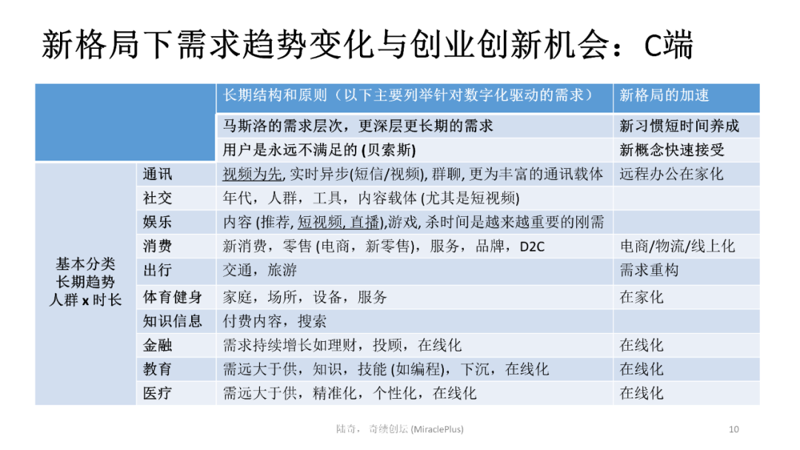  
首先我们看一下C端，本质上可以把人群和人每天的24小时分一下，你就可以有一张表：老年人、中年人、小孩分别做什么，他们有什么需求，以及如果创业的话，我们可以怎么切入。  
  
这也有一些结构化的规则可循，比如马斯洛的需求层次理论。这里我推荐给大家一个观念——用户永远不满足，这是亚马逊的创始人贝佐斯写给投资者的话。这也诠释了为什么今天像Zoom这样的公司，可以成功做起来，尤其在已经有很多做视频会议软件的环境下，因为这就是一个没有被满足好的需求。  
  
以前我们在YC投资也会有这个感知，如果一个赛道不断有创业者涌入，很有可能这个需求没有被满足好。不要因为看到某赛道已经有产品就不做了，因为用户永远不满足。  
  
新格局当然有很多加速机会，这里我选几项讲一下。  
  
第一，通讯是人类永远的刚需，视频为先的时代到了，特别是异步实时，过去的视频通讯走不到主流，因为它是同步的，人的协同代价太高了。如果视频可以做到异步通讯，这将是一个了不得的变化。  
  
第二是社交，我们永远看好新一代的社交，因为社交是一代一代的，今天的主流社交，年轻人不会去用，下一代不会去用。此外，内容也在发生迭代，比如从文字图片到视频，社交也会因此而变，所以社交永远有机会。  
  
第三是娱乐，特别是内容推荐、视频、直播、游戏，这是我们长期一直看好的，因为长期来看，人越来越大的刚需是消磨时间，且新一代数字化的工具和流程能更有效地去制作好的娱乐内容，所以这是非常好的一个商机。  
  
第四消费，在中国会带动很多所谓的新消费。  
  
最后还包括教育和医疗。在中国，这两点需求远远大于供给，机会本身就在，用技术或新的方法，更好地满足教育的需求。所以C端我们会建议创业者用系统方法做类似的分析，然后看新的格局下有哪些是被加速的机会。  
  
### 6. 新格局下B端需求分析  
  
B端的需求分析不一样，首先大B和小B很不一样，在美国还没有一家企业可以同时服务大B和小B。因为产品文化不一样，需求也不一样。但是任何企业的核心需求是一样的，即降低成本、提高产出。它需要将数字化、自动化、信息化，用于生产、销售、客户管理、员工管理、供应链、资金管理等方面。  
  
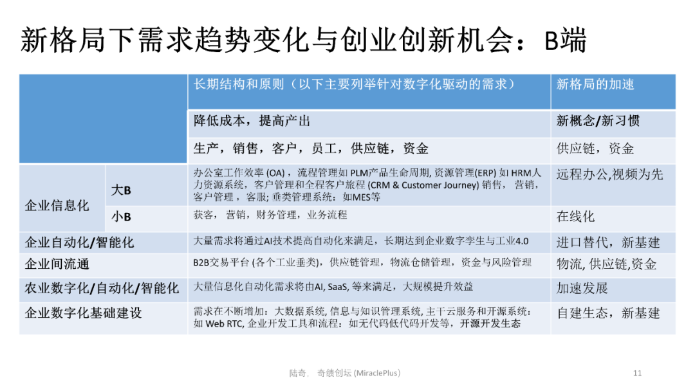  
大B企业的信息化和自动化，更长期是企业的智能化，是一个非常主流的赛道，核心要解决的是销售，这在中国有更多挑战，但需求很明显。  
  
小B最强的刚需永远是获客，对于现金流的需求、财务管理、营销管理、业务流程的自动化相对来说较少。  
  
企业的自动化和智能化是我们非常看好的，因为数字化到了一定程度以后可以开始做自动化，相当于一楼搭好搭二楼，这需要时间，但是目前自动化的机会越来越多。企业之间的流通，包括产业互联网、供应链、数字化、管理，都是非常好的机会。  
  
再讲下农业，农业基本上没有被数字化，因为电脑、鼠标、键盘没有办法数字化农业，它只能把办公设备数字化，即使手机也没有办法数字化农业。农业数字化需要更多传感器埋在地里。所以农业很特殊，它是数字化、信息化、智能化一起做，所以农业类创业公司有创造高价值的机会。  
  
最后，在中国很大的一个需求点，就是企业数字化的基础建设，包括基础云原生的服务和设施、低代码无代码、开源开发等，这是我们在奇绩创坛非常看好的一个长期赛道，特别是在中国的环境下，有大量的需求和机会。  
  
### 7. 新格局下市场环境变化  
  
讲了技术判断、需求判断，下面简单说一下市场结构如何判断。  
  
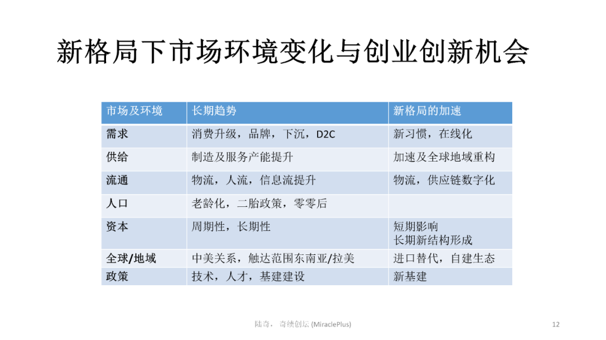  
市场结构里，需求端其实不用多说，中国的需求一直在往上走，供给方面，服务业、制造业，特别是服务业值得大家关注，流通上物流、人流、信息流会自然加速。  
  
人口方面，二胎政策、老龄化，这些会让中国的人口增长，所以中国的经济增长也是不可忽略的驱动因素。  
  
资本方面，全球资本环境短期内会有非常大的不确定性，因为疫情造成大量的QE放水，放水完了资本市场需要实体经济来支撑，但是长期我们需要关注中国的资本市场，可以让创业公司在国内退出，有获得更好的资本支持的机会，这个趋向一定会发生。  
  
## 03 把握好属于创业者的机会  
  
前面分析了历史发展的进程，以及在中国宏观上的创业机会，接下来我们会分享创业者如何把握好这些机会。我们的建议是先要回答五个问题：到底决定做什么（what）？为什么这件事情有价值（why）？为什么现在是进场的好时机（why now）？如何把这件事情做好（how）？为什么我们是能够做好这件事的团队（why us）？  
  
### 1. 创业者如何决定做什么（选择方向）  
  
首先决定创业做什么。我们要从需求、技术、市场三个方面做综合的判断，只有三者有交集的地方才是一个好的创业方向（如下图所示）。  
  
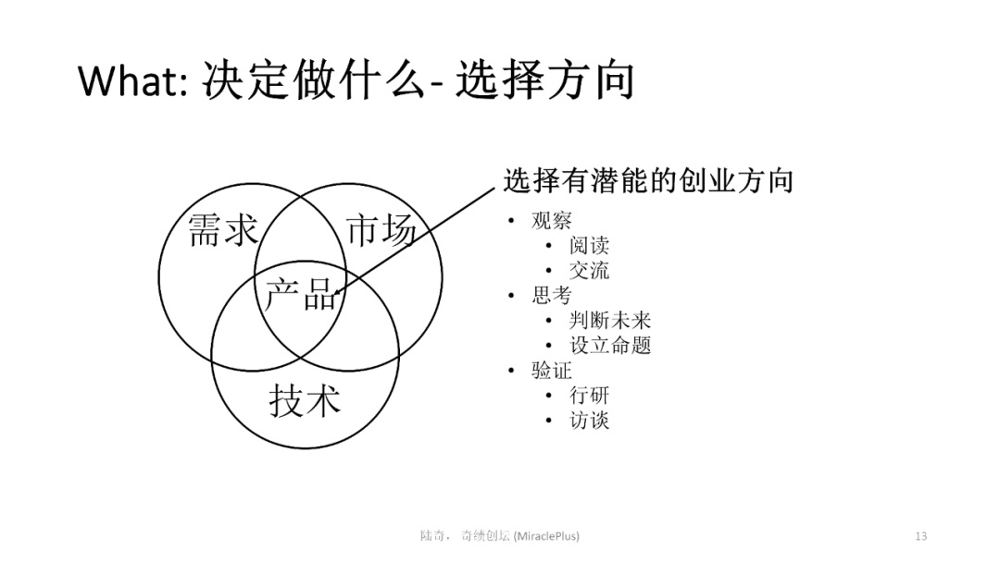  
我们建议大家建立一个体系来帮助自己做出这样的选择，首先第一步是观察，通过阅读和交流来实现，比如你对直播感兴趣，那么跟直播相关的所有文章你都可以读，跟直播相关的人，都应该尽量多地去交流，尽可能地获得跟直播相关的信息。第二步就是思考，思考的核心工作是梳理信息，并对未来做出判断，比如两年以后直播会发展成什么样子，现在的行业还缺什么新的企业，它的商业模式应该是怎样的，有了对未来的判断以后，需要设立命题，一般情况下，这个命题大概是”我可以做出XX产品，用XX样的商业模式，建立一个XX样的创业公司“。第三步就是尽快去验证这个命题，去做行业研究，并访谈行业内的人，通过这样的方式尽快去验证你的假设，并不断迭代你的想法。  
  
大部分的创业者往往会花半年时间甚至两年时间做这些事情。好的创业者往往想得很深，并看得很远，对未来有独到的见解，并且在动手之前他就已经做了很多验证。  
  
这里跟大家补充一个要点：创业在早期阶段，我们不可能想得非常清楚。网上有一个视频，Facebook的创始人扎克伯格分享了一个观点：做任何一件大的事情，你在早期是没法想得很清楚的，如果你一定要想得非常清楚才起步，极有可能会错失创业机会。因此，关键是要有勇气去迈出第一步。  
  
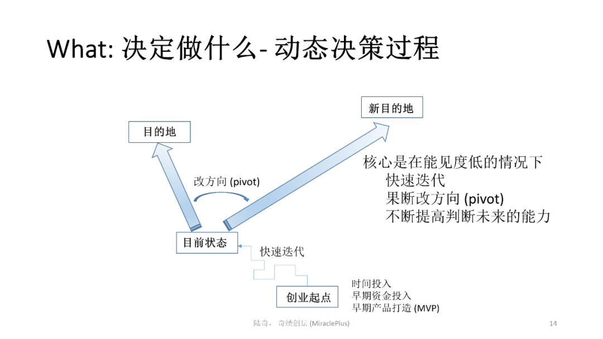  
如何迈出第一步？核心是打造一个MVP（最小可行产品），也就是一个可以让你去试的最小产品。  
  
有了MVP以后，就需要小步快跑，快速迭代，这是唯一可以提高创业成功概率的方法。因为早期创业能见度很低，就像你每天打开大门，能见度只有两米，你朝这个方向走，两米之外是陡坡还是悬崖，是桥还是平路，这些你都无法知道，唯一能提高成功率的方法就是赶快试。  
  
但是，有时候，当你试到一定阶段的时候，可能会发现原来的目的地不适合了，需要改方向。这种情况下，我们会强烈建议大家：如果你已经有足够的信息验证原来的方向走不通，就没有必要继续去碰壁。也同样需要拿出勇气去改变方向。  
  
很多公司都有改方向的经历，在YC我们见过很多案例，有一些甚至在三个月内多次改方向。所以决定创业做什么，这本身是一个不断迭代的动态过程。  
  
### 2. 创业者如何明确做的项目具有较高价值  
  
当我们决定创业做什么方向以后，还需要想明白：为什么我们做的事情具有很大的商业价值？我们强烈建议每个创业者一定要投入精力做价值分析，这至少包括如下几个点：  
  
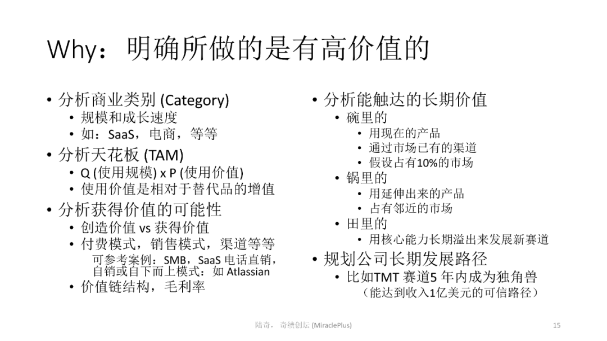  
#### （1）分析商业类别  
  
商业类别分析不是市场分析，市场由需求决定。商业类别是由供给决定的新赛道，叫category（商业类别）。你需要做一个规模和成长速度分析，其中成长速度很重要的一个指标叫年复合增长率（CAGR），我们会建议创业者选择的创业赛道年复合增长率至少30%以上，最好能到50%或以上。反过来说，如果你找到的赛道年增长率小于10%，即使你做得再大，估值也不会很高。  
  
除了增长率需要比较高，赛道体量还需要比较大，就像云和电商，它们都是体量巨大的赛道，子赛道里面的企业都可以做得很大，比如拼多多。  
  
#### （2）分析天花板（TAM）  
  
我们有一个简单公式可以估算天花板：  
  
```P （使用价值）X Q（使用规模）```  
  
其中，```使用规模（Q）```是 “有多少用户/商家会用你的产品”；```使用价值（P）```则是“用户用你的产品与不用的情况对比”、“你的产品和替代品对比的价值”，对比结果应该是成本具体降低了多少，或者产出具体提高了多少。计算一下P 和 Q的乘积，就可以估算赛道的总体天花板了。  
  
#### （3）分析获得价值的可能性  
  
不少创业者可能都没意识到，创造价值和获得价值其实是两件事。历史上很多创业公司创造了价值，客户都愿意用它的产品，但是它收不到钱，公司也没法活下去。为了避免这个问题，创业者核心需要分析付费模式是什么，销售模式是什么，是否有足够的渠道可以卖给客户。历史上很多公司，他们失败的原因就是产品卖不出去，或者市场的销售成本远高于获得的商业价值。  
  
关于触达用户的渠道分析，举例来说，在美国，创业公司如果是服务中小企业的话，历史上只有4个渠道，分别是电话渠道（电话公司会销售电话小册子）、报纸、谷歌和脸书，前两个渠道今天已经不是主要销售渠道了。  
  
渠道很重要，因为没有渠道的话，产品会卖不出去，如果渠道成本过高，创业公司则会活得很艰难。  
  
对于创业公司而言，有时候可以通过创新或者产品自己做销售，举个例子来说，澳大利亚有家公司叫Atlassian，它是做软件企业的SaaS，他们一开始就意识到 to B公司大部分破产的原因都是因为销售成本太高，所以他们很早就决定必须自己卖产品，永远都不雇佣专职的销售。最后他们也的确做到了，几年前公司也上市了。  
  
还有一点值得关注的就是价值链结构，特别是毛利。因为毛利就是销售减去成本，创业公司只有创新做得好，才能获得较高毛利，而有了较高毛利就有更多预算去做营销和市场推广。  
  
除了上述分析商业类别、天花板和获得价值可能性这三点以外，创业者还需要想清楚公司潜在的商业价值，我们做了一个比喻，用“碗里的”、“锅里的”、“田里的”这一组概念来类比公司在不同阶段的价值，具体如下：  
  
碗里的：就是用今天的产品，按今天市场能够触达的渠道去销售，假设占领市场10%的份额，计算能获得多少收入，以及未来5年能获得多少收入；  
  
锅里的：就是今天的产品可以延伸出来的产品，比如华为做了手机之后延伸做电脑；另一种延伸是用同样的基础产品去占领毗邻市场，比如从印度卖到巴基斯坦，这些方式带来的收入就是“锅里的”价值；  
  
田里的：这往往是基于你长期长出来的核心能力，溢出到新的赛道。谷歌就是这样一家公司，它的核心能力是大规模的用机器学习驱动的计算系统，它的第一个生意是搜索，第二个生意目前看来是自动驾驶，而自动驾驶本身就是大规模计算系统，用机器学习来驱动。  
  
关于创业者如何明确做项目具有高价值，我们还需要强调一点：如果你的创业是跟信息工业，特别是数字化产业有关，我们会建议你要梳理出一个可信的公司发展路径规划。因为大部分投资机构都会问：五年内能否成为一个独角兽？一般情况下，独角兽简单的实现路径就是年收入达到一亿美元，所以当你对公司的发展路径规划清晰后，也就能确定这件事情的商业价值。  
  
### 3. 创业者如何判断进场时机  
  
在美国，有一个创业者叫Bill Gross，他做了大量数据分析研究创业成功的要素，结论是创业成功的第一因素是时机，也就是什么时候进场。关于这一点，我们可以看下图，它描述了任何一个技术驱动的创业公司都会经历的曲线。  
  
  
早期（上图蓝色部分）是创新者，他们是尝鲜的人，再差的产品他都会用，所以早期有几个用户，信号价值不一定重要。  
  
第二部分人叫有远见的人（上图左侧红色部分），他们往往是企业高管，对未来有自己的想法，他们希望找到新的技术能力，帮他实现对未来的愿景。他们对价格不敏感，风险承担能力比较大。这波人比较重要。  
  
第三波是早期采纳者，这波人对技术比较开放，永远愿意用新的技术产品，但是他们一般比较务实，在企业里会扛业绩，他们是否采纳新技术产品的核心判断是：竞争对手用不用，同事用不用。所以这波人是一起过去的。他们是技术产品成功的关键。  
  
有远见的人和早期采纳者之间存在裂缝（如图），这就是我们常说的”鸿沟“，历史上的企业创新，大部分都死在鸿沟里，所以时机很重要。  
  
为了判断时机，另一个参考方法是看Gartner技术成熟度曲线（上图中蓝色曲线）。每一代新的技术诞生后，整个社会都会特别地关注，媒体也会大量报道，但是一旦开始使用，大家就会发现体验不合格、价格还很贵。于是社会又会进入一个唱衰期，就像今天的人工智能领域一样。但是，唱衰的时候往往也是进场的最好时机。  
  
乔布斯曾经有一句话，判断方向其实比较容易，判断时机往往很难。以苹果为例，苹果永远不是第一个做手机、手表、平板电脑，但是苹果选择进场都是泡沫破灭、市场已经被教育后的时间点。  
  
另外，我们发现越来越多的创业者，比如做脑机接口和量子计算的创业公司，他们即使知道现在进场还太早，但是为了避免将来市场进入红海，他们会选择提早进入。需要提醒的是，这类创业者需要打造自身的长期造血能力，尽可能让公司活得更久。  
  
### 4. 创业者如何打造能力建立壁垒  
  
下面说一下如何打造壁垒。创业者经常被投资人问：你到底有什么样的能力可以形成壁垒？大厂进来竞争，你怎么办？每位创业者都需要思考这个问题，我们总结了几种常见壁垒：  
  
  
网络效应：简单来说就是用户越多，产品越好用，社交就是典型的例子。它往往可以形成 winner take all（赢家通吃）的市场，长期则是一家独大。  
  
强规模效应：大部分企业都有规模效应，但有的是强规模效应。比如有很多数据累积的企业，他们是可以形成很大壁垒的。  
  
特殊能力，特别是技术驱动型创业者，可以通过专利来形成壁垒。  
  
市场位置优势：特别是2B企业，因为2B销售很难，但是成功销售进去之后出来也很难，因为客户切换成本高，你只要进去就出不来，这就可以成为壁垒。比如客户一旦使用了你的SaaS，他需要把工作流程等很多东西重新改，所以他不会轻易买，但是也不会轻易换。  
  
有时候壁垒是特殊资源和特殊关系，还有的时候是先发优势，特别是需要练内功的企业，即便对手知道如何做，也得至少两年才能做到今天的水平。长期的壁垒是品牌，但是对创业公司这需要较长时期才能形成。  
  
### 5. 创业者如何打造能胜任的团队  
  
在描述清楚了做什么、为什么有价值、为什么现在是进场好时机以及如何打造壁垒后，创业者还经常被投资人问到：为什么你们团队可以做好这件事。早期创业团队一定要会回答这个问题。  
  
下图是一个思维模型。左边的圆圈内核是创始人团队，我们认为一个企业能不能走远，本质上是由创始团队决定的。创始人团队有几个能力特别重要：  
  
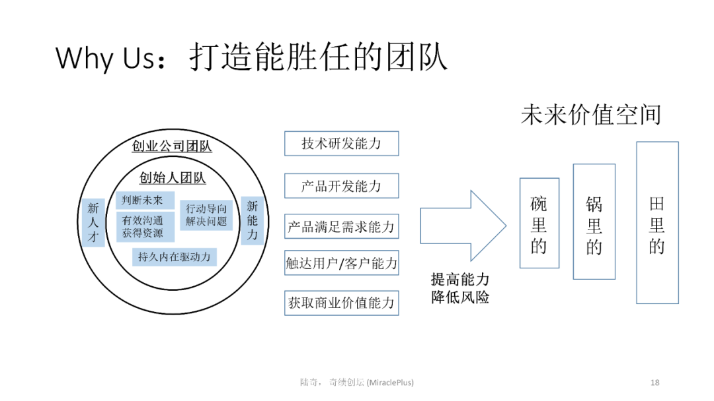  
第一是判断未来的能力，对未来一定看得远，要有独到的见解。  
  
第二是沟通的能力，早期沟通特别重要，想清楚、讲明白是非常核心的早期能力，因为早期获得资源，比如融资，雇人，战略合作等，都需要靠沟通能力。  
  
第三是行动导向、解决问题的能力，创业公司每天都在解决新的问题，快速解决是核心，任何问题都不要超过一个礼拜，大的问题永远可以拆成子问题。  
  
第四是长期的内在驱动力，为了获得财富去创业是没有问题的，但是长期还是需要一个内在驱动力，因为有很多时候，创业会艰难到走不下去，或者财富自由后还是需要继续做下去。  
  
创始人团队有了内核能力就可以不断吸收新的人才进来，未来可以满足客户和用户，去触达市场。有内核能力以后也可以按需要建立技术研发能力、产品开发能力、以及快速迭代用产品满足用户需求的能力等，对硬件产品这里包括供应链管理和渠道能力，对在线产品，也就需要相应的运营能力。  
  
此外，还要有触达用户的能力，包括增长、销售、渠道、一切能力最后都是要触达用户，而且光触达还不行，还得收费，能够盈利，拿到高毛利，只有这样才能跑通。  
  
所以创始团队为什么能够把这件事情做好，就是从创始人自身能力开始，判断好未来，不断沟通，引入新人才，打造这些能力，不断地触达碗里的价值、锅里的价值、田里的价值。  
  
为什么创业公司估值会上去？A轮到B轮凭什么涨一倍，就是因为这些能力提高了、风险降低了，等公司上市后进入二级市场，风险就更低了，分析师都可以把下一个季度收入预算出来。  
  
## 04 早期创业最重要的两件事  
  
找到产品市场匹配和更久地活下去  
  
下面我介绍一下奇绩创坛，奇绩核心希望通过社区能够跟每个创业团队沟通，帮助创业者把握机会。我们起步是YC中国，我们是站在巨人肩膀上，把YC过去15年在美国和全球得到充分验证的、非常独特的早期创业公司加速的模式，进行了彻底的本土化。  
  
我们的使命是在源头最大化地驱动创新，我们现阶段的工作主要是加速早期创业，特别是技术驱动型创业企业。我们的核心做法就是像联合创始人一样，帮助创业者一起解决问题。我们聚焦两点，加速产品市场匹配和活得更久。我们的价值观是创始人为先，最重要是服务好创始人，我们的愿景是共建繁荣的创业者社区。  
  
我们创业营里面做两件核心事情：  
  
### 1. 创业者如何更快找到产品市场匹配  
  
第一件事情是帮助每个创业团队更快地找到产品市场匹配（PMF），在创业早期，这是非确定性最大、风险最高，但是价值提升最高的一环。  
  
  
找到产品市场匹配是一个结构性的门槛，且越来越不容易过。因为创业起点是一个好的想法，发明一种技术，用这个技术开发产品，开发完了就切入市场。但是，随着教育的普及、技术的发展，好的点子越来越多，好的发明越来越多，技术和产品开发也越来越快，可每个人一天只有24小时，你就会卡在这里（上图中心位置，PMF），你要找到产品市场匹配，你要切入的市场是越来越拥挤的赛道。  
  
你唯一可以做的就是每一样都往前移。如果有好的想法不要等产品出来才去验证，要做行业研究，去找人交流。有一个新技术，也不要先急着开发产品，先去看这个技术可以做什么，先找验证，找信息。  
  
核心就是提前用最低的时间和机会成本去验证这个事情值不值得做，真正能提高成功概率的就是迭代，以及降低试错成本。  
  
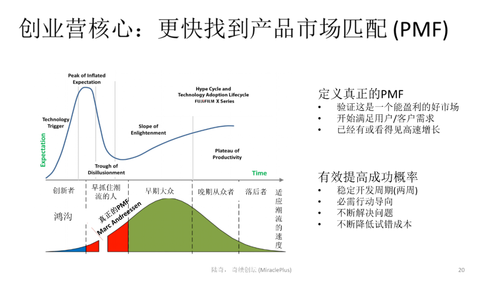  
这里有两个重要的点跟大家讲一下：  
  
第一，什么是真正的PMF？美国有一个投资人叫Marc Andreessen，他是发明PC互联网的一个主要的人。他说真正的PMF有几个特点：第一是好的市场、能够赚钱，第二产品开始供不应求，第三竞争者开始冲进来。  
  
所以大家核心做的验证是第一能否赚钱，尽可能找数据、案例验证，第二，开始满足客户的需求，比如原来用户要花一个小时，现在只需要五分钟，以前没有满足的或者以前被满足不好的需求，现在被满足了。第三，一定要看得见增长，如果看不见增长，大概率上是你产品没有做好，或者产品做好市场没切对，或者是伪需求。  
  
所以真正的产品市场匹配一定要关注这些，然后是行动导向，不断解决问题，这是我们跟创业团队在创业过程中核心做的事情。  
  
### 2. 创业者如何更好地活下去  
  
我们在创业营做的第二件事：帮助创业者活得更久。  
  
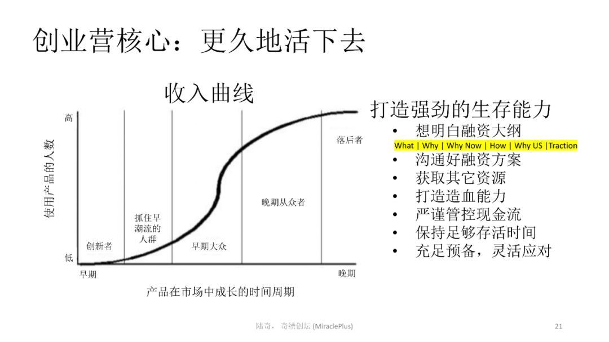  
任何一个企业都是这样，早期要活下来基本靠融资，早期基本是靠人，核心是想明白融资大纲，就是刚才讲的这五点（what/why/how/why us/why now）加上进展，你想清楚，跟投资者沟通清楚，比如为什么要这笔钱？这笔钱怎么用？有这笔钱公司如何走向下一个阶段。除了融资造血，有时候还要打造造血能力，或者其它的能力。  
  
我们建议财务一定要严谨管控，保持足够长的存活时间，做好充分准备，应对不确定性。  
  
文章很长，但还是没看过瘾。关于数字化浪潮与创新机会，陆奇老师曾在混沌讲过一节课，感兴趣的同学可以点击下方小程序学习。  
  
本课中，陆奇老师围绕新经济业态，解构新经济业态的数字化本质，你将学到：  
  
- 1、了解数字化浪潮的本质和趋势  
- 2、发现趋势中的创新机会  
- 3、传统企业、成长企业、初创企业创新的难点和解决方案  
    
  
#### [PostgreSQL 许愿链接](https://github.com/digoal/blog/issues/76 "269ac3d1c492e938c0191101c7238216")
您的愿望将传达给PG kernel hacker、数据库厂商等, 帮助提高数据库产品质量和功能, 说不定下一个PG版本就有您提出的功能点. 针对非常好的提议，奖励限量版PG文化衫、纪念品、贴纸、PG热门书籍等，奖品丰富，快来许愿。[开不开森](https://github.com/digoal/blog/issues/76 "269ac3d1c492e938c0191101c7238216").  
  
  
#### [9.9元购买3个月阿里云RDS PostgreSQL实例](https://www.aliyun.com/database/postgresqlactivity "57258f76c37864c6e6d23383d05714ea")
  
  
#### [PostgreSQL 解决方案集合](https://yq.aliyun.com/topic/118 "40cff096e9ed7122c512b35d8561d9c8")
  
  
#### [德哥 / digoal's github - 公益是一辈子的事.](https://github.com/digoal/blog/blob/master/README.md "22709685feb7cab07d30f30387f0a9ae")
  
  

  
