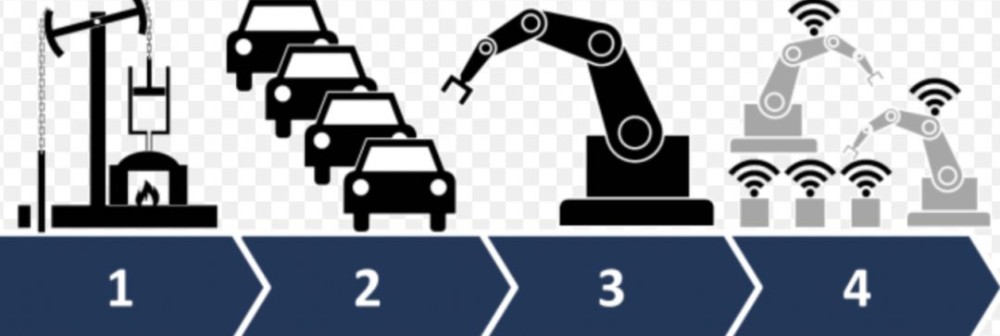
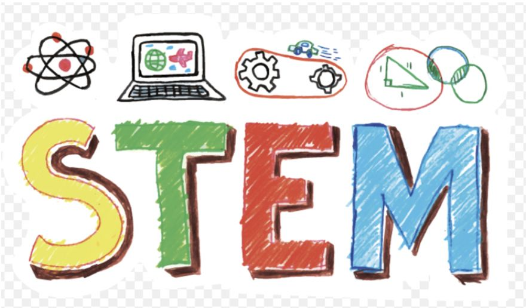

## [转载] 对话吴军：轮回的科技史，我们身处何处？该做什么事？    
    
### 作者    
转载    
    
### 日期    
2021-02-17    
    
### 标签    
PostgreSQL , 全球科技通史 , 吴军     
    
----    
    
## 背景    
原文:  https://blog.csdn.net/BigDataDigest/article/details/90603532  
    
“历史总在重演，科技是唯一可叠加式进步的动力。”  
  
  
  
五月初，在北京召开的《全球科技通史》新书发布会上，知名的自然语言处理和搜索专家、硅谷风险投资人吴军博士用这样一句话，道出了科技在人类历史发展进程中的不可或缺。  
  
  
  
的确，谈到历史，多数人会关注国家兴衰、王朝更替，而往往忽视了科技的力量。但在发明数量骤增、人工智能爆发的近几年，科技及其从业者又重回多数人的视野。  
  
  
  
身处一个快速挺进又难以把握的时代，区块链、物联网、机器学习等新层出不穷的技术名词背后，往往也伴随着个人的无力感。不管是每场讲座后还是吴军老师的微博下，“时间管理”、“买房”、“要不要读博士”等问题频繁被提及。  
  
  
  
但“太阳底下没有新鲜事”，不管“996运动”还是“技术泡沫”，回望几十上百年，历史上这样的轮回早已有之。  
  
  
  
  
  
  
  
### “我们处在什么位置，该做什么事？”  
  
  
  
这是吴军老师希望读者看完他的新书《全球科技通史》，所能得到的收获。更具体一点，科技史可以让我们消除由于对周围世界缺乏了解、对未来缺乏把控而产生的焦虑，做出更好的决策和投资。  
  
  
  
五月中旬，大数据文摘有幸对吴军进行了专访。一小时的采访过程中，吴军博士聊到了写这本科技通史的收获，他对人工智能、物联网未来20年的预测，以及对少儿编程和996等热门话题的看法，还首次分享了在他读博和工作中对他影响深刻的“朋友圈”，谈及了“圈子”对不管是科研还是职业发展的重要性。  
  
  
  
“我们正处于当年瓦特刚发明蒸汽机的（历史）位置”  
  
  
  
### “为什么要写一本关于科技的历史书呢？”  
  
  
  
回答这个问题前，吴军娓娓道来了他眼中历史进程的两种结果：一类就是像《人类简史》书中所写到的整个人类文明进步的过程，另外一类就是科技产生的持续性结果。  
  
  
  
“我们看到的政治、军事在当时产生的影响很大，但持续性较短，比如说：比如说甲午中日战争，中国的战败对当时产生了巨大的影响，可放到一百多年后的今天，中国又回到了它在世界文明中该有的地位；但科技不一样，当我们有了计算机、有了手机我们就再也回不去了，这就是科技的叠加效应。”  
  
  
  
  
  
  
  
<b>所以读科技史能让我们很好的了解我们现在处在什么位置，在这个位置上做什么事。  </b>  
  
  
  
### 那么我们正身处什么位置呢？  
  
  
  
“相当于处在1776年瓦特刚发明蒸汽机、爱迪生发明电灯又或者1965年摩尔定律提出的位置。人工智能的发展是建立在过去40年的技术积累之上，未来的20年，人工智能很难再有重大的理论突破，更多的还是人工智能在落地应用上的发展。”  
  
  
  
吴军认为，目前中国的AI市场竞争还是很激烈的，在接下来的两三年可能会有一些洗牌，各家应该也会找到各自关注的重点，集中在自己擅长的点。  
  
  
  
### 在这个节点，我们该做什么事儿？  
  
  
  
吴军建议大家可沿着两个方面去思考，一方面可以围绕两个领域去思考，也就是信息和能量。比如和信息有关的人工智能，和能量相关的新能源汽车、环保、低碳减排等，将来这些的产业规模会很大；  
  
  
  
另一方面可以寻找最大的市场，也体现在两个方面，IT技术在医疗的应用和基于IoT和5G带来的通信革命，我们可以看到全球的通信市场几乎是互联网是十倍，体量还是很大的。  
  
  
  
吴军在采访中也透露，《浪潮之巅》的第四版会在今年六月份出版，其中会添加5G、物联网和区块链等新技术的内容。  
  
  
  
物联网已经慢慢开始应用于包括智能汽车、智能家居等领域。但目前的应用过几年看，还是“有点蠢”的。“我们所说的万物互联是所有的东西自己能够相连，但问题是现在大多数的技术仍是基于手机的移动互联网。”  
  
  
  
即将到来的5G时代会将物联网的潜能大大激发。  
  
  
  
  
  
  
  
有报告显示，到2020年全世界的物联网设备差不多可以达到200亿，而目前的智能手机才30多亿，很显然4G是很难满足这种需求的，在这个背景下5G就显得非常有必要。  
  
  
  
吴军表示，物联网的发展是设备先于了基础架构的，但是随着5G的发展，基础架构和网络会渐渐满足需求，这个过程大概还需要10年的发展完善周期。因此，在这个行业，早半年也不一定是一个优势，但大家要看好这个机会，发展的趋势是存在的。  
  
  
  
### “让我受益终身的圈子”  
  
  
  
在新书中，吴军多次提到了科技发明的“圈子”。  
  
  
  
比如瓦特发明蒸汽机打开了工业革命的大门，而他背后有着这样一群功不可没的小圈子——“瓷器大王”韦奇伍德等人组成的“月光社”。这是一群对科技感兴趣的人士，每逢月圆之夜会在伯明翰讨论科学的小聚会。  
  
  
  
<b>在采访中，吴军也首次分享了让他受益匪浅，属于自己的“月光社”。</b>  
  
  
  
他介绍道，在美国学术界有一个类似学派的说法。因为有的人做学问比较执着，经常会坚持自己的观点，沿着一个方向研究到底。通常是一位比较有名的教授或者学者，聚集了一帮有共同学术认同的研究者，所以慢慢的就会形成一些学派，比如哥本哈根学派，相对应的还有爱因斯坦学派。  
  
  
  
在人工智能自然语言处理方面，吴军称自己在约翰·霍普金斯大学的博士生导师 Frederek Jelinek便是一个学派领导者，Jelinek教授是提出数据驱动来解决人工智能的先驱，包括李开复的很多工作也是受他启发。  
  
  
  
<b>Jelinek每年夏天都会邀请世界上20-30名顶级的科学家和学生到CLSP一起工作，使得CLSP成为世界上语音和语言处理的中心之一。其中也有导师曾经的学生或下属，均在各大学当教授或者大公司做科研，比如当时贝尔实验室的第一把手，高通的创始人维特彼博士，这让自己有机会开始接触顶级的科学圈子。</b>  
  
  
  
  
  
  
  
“在一起工作不仅仅能碰撞出思想的火花，也让我们这些人能够更早的接触到整个圈子。” 比如，吴军提到除了暑期的活动，Jelinek教授还会每周邀请一个专家来做报告， 这样大概过了三年， 整个学术圈的教授们也就混熟了，都可以直呼其名了。  
  
  
  
<b>吴军说：“谷歌机器翻译大神奥科博士其实我们很早也认识了，当时他的导师也会经常来学校，最后从我大学离开到了谷歌，也就更容易被大家认可了。”</b>  
  
  
  
<b>“2010年，因为导师的去世，让我们这个圈子的人又聚在一起，大部分来自谷歌，最后我们以导师的名义设立了一个奖学金。通过这件事也能够看到圈子的重要性，即使我们都已经离开原有的学校或工作单位。”</b>  
  
  
  
但吴军也表示，没有必须为了“圈子”刻意去接触某些人。“因为光认识是不够的，你需要真正和他们共事过才会更容易被接受。所以读博的话，最重要的还是选择教授，最好是主流学术圈大家公认的领袖，这会让你受益一辈子。”  
  
  
  
### 关于996，“我当年在谷歌也很少12点前下班”  
  
  
  
吴军一直是业内非常质量与产量双高的作家。从最早的“谷歌黑板报”，到2011年的《浪潮之巅》、《数学之美》、《文明之光》、《大学之路》、《硅谷之谜》、《智能时代》，再到《见识》和最近出版的《全球科技通史》，在日常工作之余，他几乎是每年一本的速度迅速完成了知识的积累和输出，并且出版物的质量颇高。  
  
  
  
但是，如此自律且对时间高度把控的吴军，在年轻的时候也常常加班：“其实我们在谷歌工作的时候，几乎也是很少晚上12点前下班的。那时候谷歌还是个小公司。”  
  
  
  
因此，当被问及如何平衡家庭与工作的时间，以及996的问题时，吴军也颇为感慨地分享了自己的两个观点。  
  
  
  
关于加班我们需要区分看待， 一类是你自己主动工作到很晚。比如一些创业小公司为了生存没有办法。之所以很多人愿意工作很长时间， 是因为他们每做一份工作都可以看到回报，这个回报也许不是现金的回报，有可能是能力的提高，未来职业发展道路，或者公司上市会给你带来的巨大经济利益。  
  
  
  
另一类是有一些公司强制性工作到很晚，其实既没有必要也违反劳动法。这就像大学读书，你花时间复习了就可以提高成绩，如果996没有回报，大家都在耗时间，那其实对个人是一件很伤的事儿。不仅占用了时间，也没有时间去思考，对长期的职业发展其实是有害的。“  
  
  
  
  
  
  
  
吴军直言，其实很多程序员有时候每天加班工作一个小时匆忙把活完成了，但只要错一点你花上10个小时也未必能找到错误，并不是你花时间越多结果就越好。坦率来讲，很多人每天工作10个小时，可能有5个小时都是没有用的，把时间管理好应该就没那么忙了。  
  
  
  
比如开会，其实四五个人可以商量的事情，根本不需要拉个20人的群，开个会大家也是干坐着，无形中增加了大家的工作时间。如果企业和个人都利用好这些时间，其实我们还可以干很多事！  
  
  
  
### “少儿编程也是一种通识教育”  
  
  
  
在最新作品《全球科技通史》扉页，吴军把这本书献给了自己的孩子和夫人。作为一名父亲，吴军对于教育问题也一直非常关心。  
  
  
  
随着人工智能等技术的发展，少儿编程得到了很多人的关注，也逐渐获得了中国家长的认可，并很快成为他/她们的“教育刚需”。  
  
  
<b>吴军对此也有自己的看法，他认为少儿编程其实只是一种科学思维的培养方式，学到什么可能不是最重要的。在孩子的成长过程中，需要有通识教育，如传统的数理化政史地等课程。但到了信息革命以后，就增加了另一种基础教育，有一个名词叫“STEM”（Science、Technology、Engineering、Math）。</b>  
  
  
  
“我们上小学学习的那些东西， 到了初中你可能一年就学完了， 但这个过程重要是的从小培养一个科学思维和思考问题的态度，做事情严谨的素养和基本的数学头脑。在时间和精力比较充裕的情况下，是可以进行科学思维的培养。”  
  
  
吴军在采访和演讲中也多次强调，科学与科技是经常被混为一谈的两个词，科学也就是说在短期内你可能看不到结果，但多年后你需要用到一项技术，可能就需要以前的一个科学成就。  
  
  
<b>“大概在十几年前，中国开始提高对科学本身的重视程度，可从今天来讲，大众对科学的理解还是很少的。但我相信往后的中国，继续发展不仅仅需要技术，也需要科学。”</b>  
  
  
当我们的5G、物联网、人工智能等技术都处在同一起跑线时，接下来怎么做，就比谁有更多的基础科学底蕴，谁就会更长久地处于一个有利的位置了。  
  
    
  
#### [PostgreSQL 许愿链接](https://github.com/digoal/blog/issues/76 "269ac3d1c492e938c0191101c7238216")
您的愿望将传达给PG kernel hacker、数据库厂商等, 帮助提高数据库产品质量和功能, 说不定下一个PG版本就有您提出的功能点. 针对非常好的提议，奖励限量版PG文化衫、纪念品、贴纸、PG热门书籍等，奖品丰富，快来许愿。[开不开森](https://github.com/digoal/blog/issues/76 "269ac3d1c492e938c0191101c7238216").  
  
  
#### [9.9元购买3个月阿里云RDS PostgreSQL实例](https://www.aliyun.com/database/postgresqlactivity "57258f76c37864c6e6d23383d05714ea")
  
  
#### [PostgreSQL 解决方案集合](https://yq.aliyun.com/topic/118 "40cff096e9ed7122c512b35d8561d9c8")
  
  
#### [德哥 / digoal's github - 公益是一辈子的事.](https://github.com/digoal/blog/blob/master/README.md "22709685feb7cab07d30f30387f0a9ae")
  
  

  
